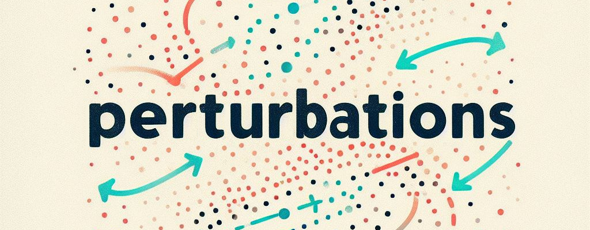
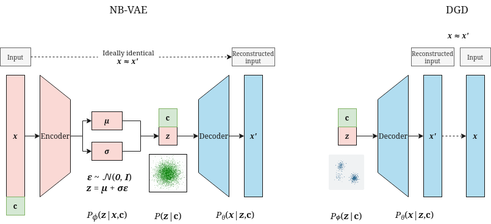
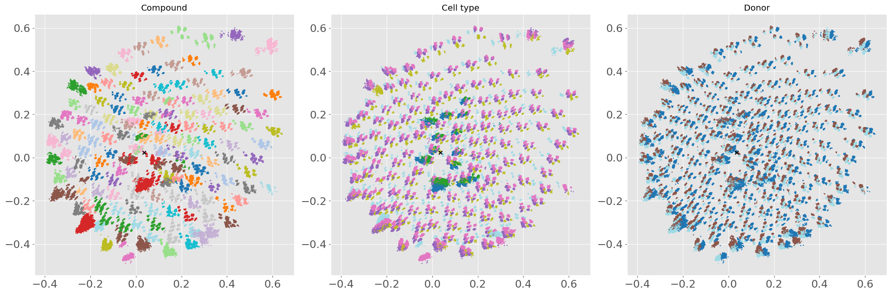
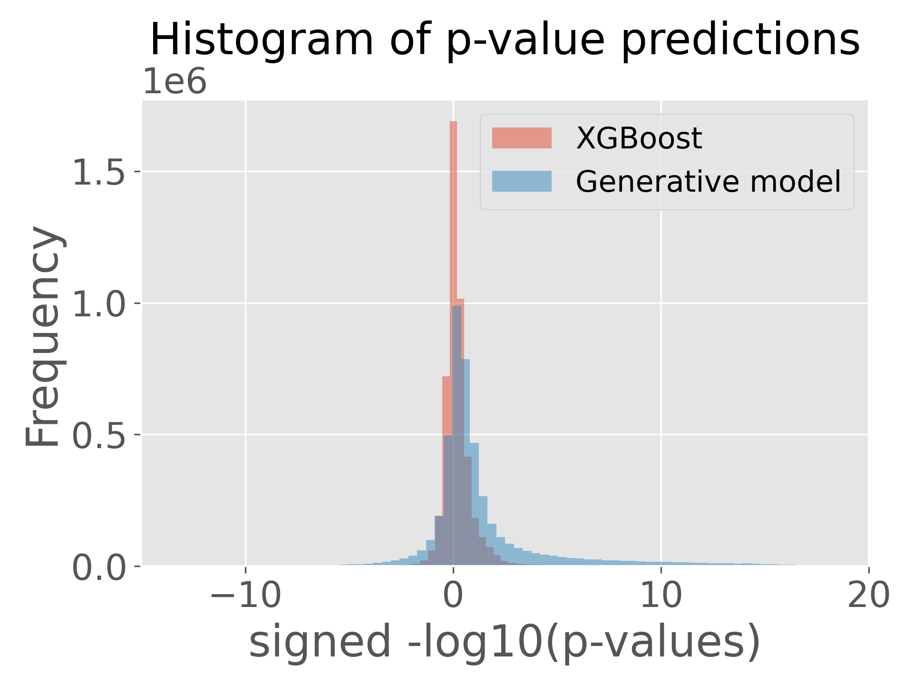

# [OPSCP][op] – Learnings from generative models
Disregarding good MRRMSE scores for this particular dataset, I focused on generative models for the single-cell transcript data. These generative models can be used in a larger variety of research tasks than the regression models that dominated the competition. Few teams attempted this route, so I believe one writeup is warranted.

### Running the project
To reproduce the results, follow these steps: 
1. Download and unzip all Kaggle files to `data/`.
2. Make sure the installed libraries follow the versions in `requirements.txt`. Further, an R environment corresponding to the [Saturn image][1] is required. 
3. Run the `perturbations.ipynb` notebook.

[1]: https://github.com/saturncloud/images/tree/release-2023.05.01/saturn-python-pytorch
[op]: https://www.kaggle.com/competitions/open-problems-single-cell-perturbations

\

## 1. Integration of biological knowledge
To handle the count data, I use a negative binomial (NB) posterior. Like the Poisson, this takes sequencing depths into account. The NB further accounts for overdispersion, and is empirically found to fit scRNA-seq data well — also outperforming zero-inflated versions ([Grønbech, 2020][scVAE]). The NB density for observing $k$ gene counts is parameterized by mean $m$ and dispersion $r$:

$$ {NB}(k;m,r) = \frac{\Gamma(k+r)}{k!\,\Gamma(r)} \left( \frac{m}{r+m} \right)^k
\left( \frac{r}{r+m} \right)^r $$

The generative model outputs the mean scaled by the max count for the sample, while one $r$ is learned for each gene (sample independent). 

Since the ATAC data does not have cell ids matching the scRNA-seq data, I did not integrate it into the model. 

<!-- How does your model integrate biological knowledge into predictions? We want to know what you tried, and how it worked! This may include, but is not limited to:

    How did you integrate the ATAC data? Which representation did you use?
    How did you integrate LINCS data? How did this improve your model?
    Did you use the chemical structures in your model?
    Did you use other data sources? Which ones, why?
    What representation of the single-cell data did you use? Did you reduce genes into modules? Did you learn a gene regulatory network? We want to know!
    If adding a particular biological prior didn’t work, how did you judge this and why do you think this failed? -->

## 2. Exploration of the problem
In principle, generating cells in the 'requested' cell_type/compound pair and feeding them to Limma seems reasonable. However, running the provided `compute_de.ipynb` notebook gives a mismatch with the p-values of `de_train` (also after taking the `excluded_ids` file into account and fixing metadata slightly). This means that even if the generative model learns a perfect reconstruction of the training data, it will still have an MRRMSE offset of 0.0325. Further, limma is sensitive to the amount of cells in each covariate group, making the sampling of realistic cell counts with corresponding metadata non-trivial. These aspects favored directly regressing the DE results.

From simple statistical measures, NK cells were found to overlap best with the cell types in the private test set. This was further noted by [others during the competition][nk_cells]. 

There is a large proportion of cells from the positive control compounds compared to the rest of the data; I found it better to remove these cells from the dataset. It might further be useful to remove outlier compounds with few cell measurements. 

<!-- We’re interested in understanding the problem of generalizing perturbation responses across cell lines. We hope this competition not only produces record-breaking models, but also helps us better understand the problem. Here are the kinds of questions we want you to help us answer:

    Are there some cell types it’s easier to predict across? What about sets of genes?
    Do you have any evidence to suggest how you might develop an ideal training set for cell type translation beyond random sampling of compounds in cell types?
    What is the relationship between the number of compounds measured in the held-out cell types and model performance? Is there a sweet spot? -->

## 3. Model design
I experimented with the Deep Generative Decoder (DGD) of [Schuster & Krogh, 2023][DGD] and found it to achieve better scores (PB 1.39) than an NB-VAE variant (PB 1.81). Both types outperformed a traditional VAE on normalized data subsequently rescaled back. In each case, I maximize the ELBO using Pytorch with, e.g., NB negative log likelihood as reconstruction error and with early stopping to prevent overfitting. Annealing the KL term from 0 to 1 over 50 warmup epochs avoided some cases with exploding loss. The encoder/decoder architectures are fully connected networks with ReLU activations and three layers transformings the dimensions to [5; 256; 1024; 18211]. Models are visualized on the diagram below. 

When predicting compounds as a task, the latent space separates into meaningful clusters, but the model does not generalize well for compounds in the test set (perhaps due to the large imbalance of cell type classes). For the below image, a latent space of 2 dimensions was used with the DGD model — the clusters highly correspond to compounds, cell types and donors. 

Conditioning the generative model on the covariates necessary for the limma analysis (cell type; plate name; well) gave best results on the PB. These conditional variables correspond to the `c` in the earlier model overview. In practice, the models are thus a conditional-DGD and a conditional-NB-VAE, where the one-hot-encoded covariates are appended to the data before encoder and decoder forward passes. After conditioning, the cells do not form distinct clusters based on the metadata — a natural effect of the conditional variables ([Kristiadl, 2016][cvae]). Instead, they appear to be completely mixed together in a N(0,1) distribution (see github notebook). To generate a realistic number of cells and library sizes, two random forests were trained using the covariates as one-hot features; this step is important to get better p-values from limma.

Random forest regression directly on the pseudo-bulk counts yielded a better score (PB 1.01), while bleak compared to just the zero-matrix (PB 0.9) or an out-of-the-box XGBoost on the p-values (PB 0.62) with one-hot-encoded sm_name/cell_type features. Interestingly, when combining the regression XGB submission with the DGD submission, performance improved slightly (0.002 improvement). p-values from the generative AI -> limma pipeline had much larger variance than XGB p-values (see figure below), which could be reduced by averaging over multiple runs, but time did not allow for this. In general, these results provide a large degree of skepticism towards either 1) the generalization ability of generative models for this data, or 2) the metric used. 

    

The performance of models already in the perturbation literature such as scGen ([Lotfollahi, 2019][scGen]), scTenifoldKnk ([Osorio, 2022][scTenifoldKnk]), and CellOT ([Bunne, 2023][CellOT]) would require more engineering to generate cells feasible for good limma p-values -- I did not have luck in initial experiments, which is why I sticked to the more direct approach of cell generation conditioned on the covariates. 

<!-- It’s no secret that the top models on the leaderboard are often complex ensembles super-tuned to the test data, and this is amazing for our application. That said, we’re also interested in knowing if there are specific classes of models that perform especially well.

    Is there certain technical innovation in your model that you believe represents a step-change in the field?
    Can you show that top performing methods can be well approximated by a simpler model?
    Is your model explainable? How well can you identify what is causing your model to respond to certain inputs? -->

## 4. Robustness
A validation set is always needed during the stochastic training of the model — we cannot be sure that by running it again with a full dataset that the training will go in the same way. Here, I used a small subset of randomly sampled points (3%) but manually including cells relevant to the test set in the training set. These relevant cells have either cell type or compound occurring in the test set. Randomly sampled cells remove some complexity regarding choice of validation scheme, and was feasible since the location of reconstruction minima was generally the same across cell types. I used the smallest set size where the validation loss was still stable during training. During development and to experiment with hyperparameters, the validation set was instead made by excluding some compounds with cell type NK from training, which were found to best overlap with the test cells. 
 <!-- I found the NK cells to overlap best with the private test set cell types. -->

Instead of counts or p-values, a potential ideal task for estimating perturbations could be to compute the likelihood of private test counts under the density of parameterized distributions per gene per cell. The task would then be to give parameters which maximize the likelihood of the held-out data. In this setup, the metric would be the log-likelihood summed over all genes over all cells. Further, instead of removing the variability from technical sequencing effects, these could be used as just additional features. This gives some more leg room for model choice as it does not force teams to try predicting the distribution of the metadata in order to get good p-values from limma. 

<!-- How robust is your model to variability in the data? Here are some ideas for how you might explore this, but we’re interested in unique ideas too.
    Take subsets of the training data (e.g. 95%, 90%, …, 10%). How well does your model performs as a function of percentage of the training data?
    Add small amounts of noise to the input data. What kinds of noise is your model invariant to? Bonus points if the noise is biologically motivated. -->

## 5. Documentation & code style
The code is documented on [the Github page][github]. 

<!-- Here we want to make sure your model and analysis notebooks are well documented and follow a consistent code style. At a minimum, we want to see:

    Documentation describes the general methodology of the solution
    Documentation describes the required hardware and software dependencies, as well as how to install and run the software
    Functions and their arguments are documented
    Code follows basic good practices for the chosen programming language. For example: PEP8 for Python, tidyverse style guide for R
    Code does not contain duplicated code -->

## 6. Reproducibility
Code is available on GitHub: https://github.com/yhsure/kaggle-perturbations.
Instructions for running the project are available in the README.md file.

<!-- 
Here we want to make sure your model and notebooks are reproducible by other scientists.

    Code is available on GitHub
    A list of required dependencies is available (e.g. dependencies.txt for Python)
    Repository contains a Dockerfile or Viash component which can be used to train and run the model
    Documentation contains an example of how to run the method using the Docker container or Viash component -->

## References
Grønbech, Christopher Heje, et al. "scVAE: variational auto-encoders for single-cell gene expression data." Bioinformatics 36.16 (2020): 4415-4422.

Schuster, Viktoria, and Anders Krogh. "The Deep Generative Decoder: MAP estimation of representations improves modeling of single-cell RNA data." arXiv preprint arXiv:2110.06672 (2021).

Kristiadi, Agustinus. "Conditional Variational Autoencoder: Intuition and Implementation." (2016).

Lotfollahi, Mohammad, F. Alexander Wolf, and Fabian J. Theis. "scGen predicts single-cell perturbation responses." Nature methods 16.8 (2019): 715-721.

Osorio, Daniel, et al. "scTenifoldKnk: An efficient virtual knockout tool for gene function predictions via single-cell gene regulatory network perturbation." Patterns 3.3 (2022).

Bunne, Charlotte, et al. "Learning single-cell perturbation responses using neural optimal transport." Nature methods (2023): 1-10.

[scVAE]: https://academic.oup.com/bioinformatics/article/36/16/4415/5838187
[nk_cells]: https://www.kaggle.com/competitions/open-problems-single-cell-perturbations/discussion/457793#2541075
[DGD]: https://arxiv.org/abs/2110.06672
[cvae]: https://agustinus.kristia.de/techblog/2016/12/17/conditional-vae/
[scGen]: https://www.nature.com/articles/s41592-019-0494-8
[scTenifoldKnk]: https://www.sciencedirect.com/science/article/pii/S2666389922000010
[CellOT]: https://www.nature.com/articles/s41592-023-01969-x
[github]: https://github.com/yhsure/kaggle-perturbations